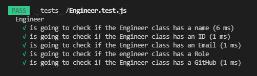
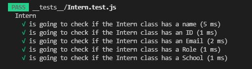

# Team Profile GENERATOR

## Table of Contents:

- [Git-Repository](#git-repository)
- [Demo-Video](#walktrough-video)
- [Description](#description)
- [Pseudo-code-Description](#pseudo-code-description)
- [Build-Process](#build-process)
- [Installation](#installation)
- [Usage](#usage)
- [Tests](#tests)
- [License](#license)
- [Contributing](#contributing)
- [Questions](#questions)
- [Screenshots](#screenshots)

## Git Repository

I created a git repository folder that will host the finished project. The Repository will be found [here](https://github.com/pfansi/team-profile-generator)

## Link to the walktrough video

Application video [demo]()

## Description:

I will build a readme file generator application using Node.js that will allow me to quickly and easily create a readme file for my future project .

## Pseudo code description

## Build process

- created a repository and an readme.md file for the project
- ran npm init to install dependencies.
- download the inquirer.
- created the file structure for the app.
- Created an employee class and exported.
- created the text file.
- created the class Engineer and test it
- created the Intern Class file and test it.
- created the manager class file and test it .

## Installation:

---

Run this command to install dependencies:

  <pre><code>
  npm install
  </code></pre>

## Usage:

---

Run this command to start the app:

  <pre><code>
  node index.js
  </code></pre>

## Tests:

Run this command to run the test

<pre><code>
  npm run test:watch
  </code></pre>

## License:

[License: MIT](https://opensource.org/licenses/MIT)

# This Project is licensed under the MIT license

## Contributing:

Project is opened for contributions.

## Questions:

- **Contact details:**
  - Github: [@pfansi](https://github.com/pfansi)
  - Email: pfansi76@gmail.com

## Screenshots

- This is the Employee test screenshot. 

---

- This is the Engineer test screenshot. 

---

- This is the Intern test screenshot. 

---

- This is the Manager test screenshot. ---
